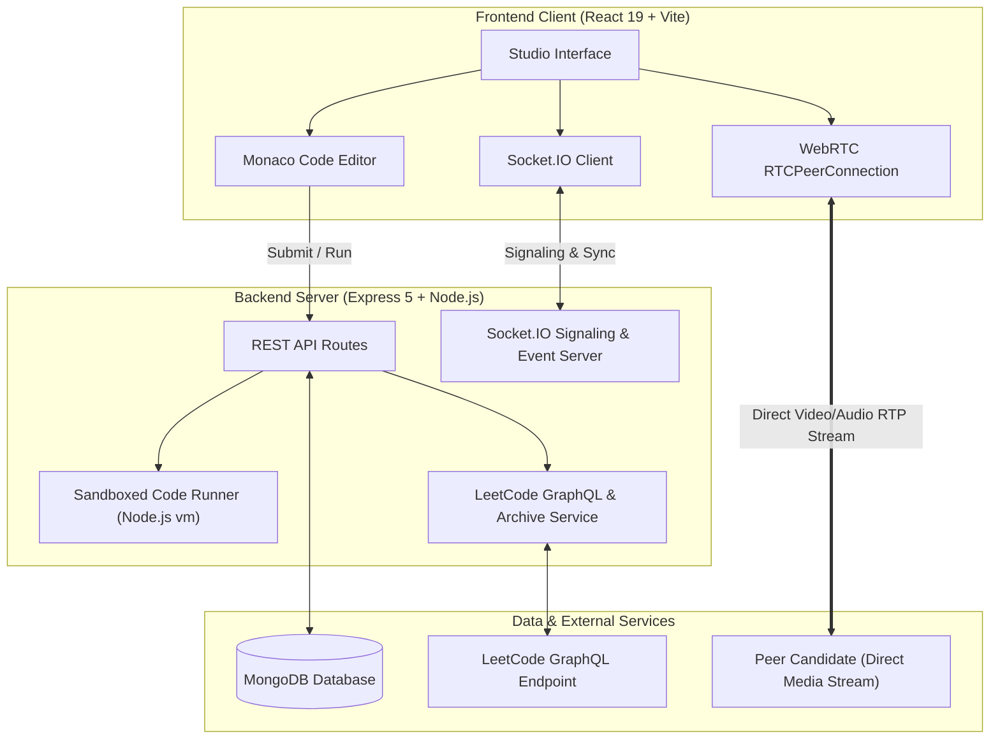
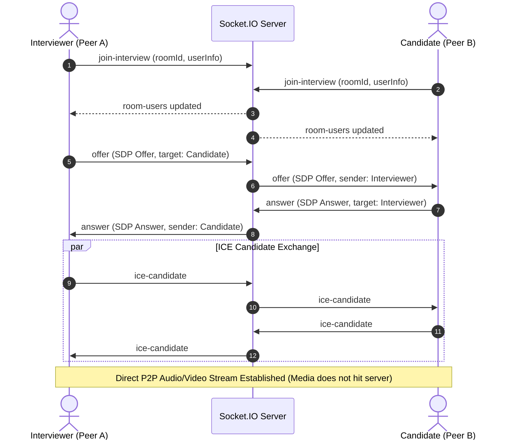

# ⚡ Talent-Rush — Real-Time Technical Interview Platform

[](https://react.dev/)
[](https://vitejs.dev/)
[](https://nodejs.org/)
[](https://expressjs.com/)
[](https://www.mongodb.com/)
[](https://socket.io/)
[](https://tailwindcss.com/)
[](https://webrtc.org/)

**Talent-Rush** is a full-stack MERN collaborative technical interview platform built for engineering teams, recruiters, and candidates. It integrates **peer-to-peer WebRTC video calling**, a **live collaborative Monaco code editor**, **real-time LeetCode question synchronization**, and a **sandboxed test case execution runner** into an encrypted technical interview studio.

---

## 🌟 Key Features

### 1. 🎥 Real-Time WebRTC Peer-to-Peer Video Calling
- **Zero-Overlap Responsive View**: Dedicated, non-collapsible upper viewport layout ensuring local and remote video streams remain fully visible alongside editor tools.
- **Hardware Controls**: In-browser toggle for microphone and camera streams with active status badges.
- **P2P Signaling**: Direct peer connection powered by Socket.IO signaling exchange (`offer`, `answer`, `ice-candidate`).
- **Connection Diagnostics**: Live indicators for `connecting`, `connected`, `failed`, or `idle` states.

### 2. 💻 Collaborative Monaco Code Editor
- **Powered by VS Code Engine**: Syntax highlighting, auto-indentation, bracket matching, and line numbers via `@monaco-editor/react`.
- **Multi-Language Support**: Write and test code in JavaScript, Python, C++, and Java.
- **Bi-directional Live Sync**: Real-time code broadcasting between interviewer and candidate over WebSockets.
- **Starter Code & Code Reset**: Pre-populates LeetCode template functions with a one-click reset to original starter code.

### 3. 🧩 LeetCode Problem Integration & Sandboxed Test Runner
- **Search by LeetCode Number**: Load any LeetCode problem directly by number (e.g. `#1 Two Sum`, `#20 Valid Parentheses`, `#314 Binary Tree Vertical Order Traversal`).
- **3-Tier Problem Crawler**:
  1. *Primary*: LeetCode Official GraphQL API.
  2. *Secondary Fallback*: Curated local problems database.
  3. *Tertiary Fallback*: Open-source LeetCode problem archive (guarantees problem descriptions and test cases even for premium/locked numbers).
- **Sandboxed Test Case Execution**: Evaluates code inside an isolated Node.js `vm.runInContext` sandbox with custom inputs, expected outputs, execution runtime measurements, and detailed pass/fail assertions.
- **Solution Submission**: Instant grading comparing actual returns against predefined test suites.

### 4. 🔗 Flexible Room Creation & Instant Joining
- **Join by Room ID or Invite Link**:
  - Recipients can enter raw 8-character Room IDs (e.g., `5a296615`) or paste full URLs (e.g., `http://localhost:5173/interview/5a296615`).
  - Intelligent URL parser automatically extracts room identifiers.
- **One-Click Share Link**: Copy full invite URLs with a single click from the interview studio header or dashboard cards.
- **Authentication Preservation**: When an unauthenticated candidate opens an invite link, `ProtectedRoute` preserves their destination and redirects them straight into the interview room upon login.

### 5. 💬 In-Studio Live Chat
- Integrated real-time messaging panel alongside problem descriptions.
- Auto-scroll, role badges (Interviewer / Candidate), timestamps, and socket broadcast isolation per room.

### 6. 🎨 Obsidian / Neon Developer UI
- Built with a cohesive high-contrast dark theme inspired by modern developer IDEs (`#0e0e0e`, `#131313`, `#1a1919`, `#262626`, `#2E5BFF`, `#A855F7`).
- Ambient background glows, glassmorphism cards, and responsive layouts across desktop and mobile screens.

---

## 🏗️ System Architecture



### WebRTC Signaling Sequence



---

## 🛠️ Technology Stack

| Domain | Technology | Purpose |
| :--- | :--- | :--- |
| **Frontend Framework** | **React 19** | Declarative component UI library |
| **Build Tool** | **Vite 7** | Fast HMR and bundle compilation |
| **State Management** | **Redux Toolkit** | Centralized global store for auth, editor, questions |
| **Styling** | **Tailwind CSS** | Custom obsidian/neon design system |
| **Code Editor** | **Monaco Editor** | Visual Studio Code editing experience in the browser |
| **Real-time Comms** | **Socket.IO Client** | WebSocket communication for WebRTC signaling, code sync, chat |
| **Routing** | **React Router DOM v6** | Client-side routing with protected route history memory |
| **Icons** | **React Icons (Feather)** | Clean UI iconography |
| **Backend Runtime** | **Node.js 22** | Asynchronous JavaScript runtime |
| **Web Server** | **Express 5** | REST API routing and middleware management |
| **Database** | **MongoDB & Mongoose 9** | Object modeling for users, interviews, and problems |
| **Security** | **JWT & bcryptjs** | Secure token-based auth stored in HTTP-only cookies |
| **Code Sandbox** | **Node.js `vm`** | Safe sandboxed JavaScript runtime environment for test suites |
| **WebRTC** | **Native WebRTC APIs** | High-definition, low-latency browser-to-browser media streaming |

---

## 📁 Repository Structure

```text
Video-Calling-App/
├── package.json                    # Root scripts for multi-package build & run
├── README.md                       # Comprehensive project documentation
├── backend/                        # Backend Express & Socket.IO server
│   ├── .env.example                # Template for environment variables
│   ├── package.json                # Backend dependencies and scripts
│   ├── server.js                   # Application entry point & socket initialization
│   └── src/
│       ├── controllers/            # HTTP request handlers
│       │   ├── auth.controller.js
│       │   ├── interview.controller.js
│       │   ├── question.controller.js
│       │   └── user.controller.js
│       ├── middleware/             # Express middlewares
│       │   ├── auth.middleware.js   # JWT authentication verification
│       │   └── role.middleware.js   # Role-based access control
│       ├── models/                 # Mongoose schemas
│       │   ├── Interview.js        # Interview room, questions, candidate metadata
│       │   ├── Question.js         # Problem title, difficulty, test cases, starter code
│       │   └── User.js             # User accounts, hashed passwords, roles
│       ├── routes/                 # Express endpoint routes
│       │   ├── auth.routes.js
│       │   ├── interview.routes.js
│       │   ├── question.routes.js
│       │   └── user.routes.js
│       ├── services/               # Business logic & integrations
│       │   ├── auth.service.js
│       │   ├── compiler.service.js # Sandboxed test runner via Node.js vm
│       │   ├── interview.service.js# Room generation & question assignment
│       │   ├── leetcode.service.js # Multi-tier LeetCode problem fetcher
│       │   └── question.service.js
│       └── sockets/                # Socket.IO event handlers
│           ├── chat.socket.js      # Room-scoped chat broadcasting
│           ├── editor.socket.js    # Code synchronization
│           ├── room.socket.js      # Presence tracking
│           ├── socket.js           # Main socket router
│           └── video.socket.js     # WebRTC signaling (offer, answer, ICE)
└── frontend/                       # Frontend React 19 + Vite client
    ├── index.html                  # HTML entry point
    ├── package.json                # Frontend dependencies
    ├── vite.config.js              # Vite configuration
    ├── tailwind.config.js          # Tailwind theme & color configurations
    └── src/
        ├── App.jsx                 # Root component
        ├── main.jsx                # Application mount
        ├── components/
        │   ├── dashboard/          # Dashboard panels, cards, and lists
        │   │   ├── Dashboard.jsx
        │   │   ├── InterviewCard.jsx
        │   │   └── InterviewList.jsx
        │   ├── interviews/         # Studio widgets
        │   │   ├── ChatPanel.jsx   # Live room chat panel
        │   │   ├── EditorPanel.jsx # Monaco editor with language switcher
        │   │   ├── JoinRoomModal.jsx# Intelligent room ID / link parser modal
        │   │   ├── LanguageSelector.jsx
        │   │   ├── OutputPanel.jsx # Test results & console output
        │   │   ├── QuestionPanel.jsx# LeetCode search & test case viewer
        │   │   └── VideoPanel.jsx  # P2P WebRTC video tile grid
        │   └── layout/             # Navigation bars and layout frames
        ├── navigation/
        │   ├── AppRoutes.jsx       # Client routing definitions
        │   └── ProtectedRoute.jsx  # Authentication gate with location preservation
        ├── pages/
        │   ├── auth/               # Login & Registration pages
        │   ├── dashboard/          # Dashboard, My Interviews, Create Interview
        │   ├── home/               # Landing page with interactive preview
        │   └── interview/          # InterviewRoom studio page
        ├── redux/                  # State management store and slices
        │   ├── authReducers/
        │   ├── slices/
        │   └── store.js
        ├── services/               # Frontend API callers & WebRTC managers
        │   ├── compiler.service.js
        │   ├── interview.service.js
        │   ├── question.service.js
        │   ├── socket.service.js
        │   └── webrtc.service.js   # RTCPeerConnection lifecycle manager
        └── socket/                 # Socket event dispatchers
```

---

## 🚀 Getting Started

### 1. Prerequisites
Ensure you have the following installed on your machine:
- **Node.js**: v18.0.0 or higher (v20+ recommended)
- **npm**: v9.0.0 or higher
- **MongoDB**: A running local instance (`mongodb://127.0.0.1:27017`) or a free [MongoDB Atlas](https://www.mongodb.com/atlas) cluster URI.

### 2. Clone Repository
```bash
git clone https://github.com/kWRizzz/VideoCalling-App.git
cd VideoCalling-App
```

### 3. Backend Setup
1. Navigate into the `backend` folder:
   ```bash
   cd backend
   ```
2. Install dependencies:
   ```bash
   npm install
   ```
3. Create your environment configuration file:
   ```bash
   cp .env.example .env
   ```
4. Update the variables in `backend/.env`:
   ```env
   PORT=3000
   NODE_ENV=development
   JWT_SECRET=your_super_secret_jwt_key
   DB_URL=mongodb://127.0.0.1:27017/talent_rush
   CLIENT_URL=http://localhost:5173
   ```
5. Start the backend server:
   ```bash
   npm run dev
   # or
   npm start
   ```
   *The server will start listening at `http://localhost:3000`.*

### 4. Frontend Setup
1. Open a new terminal and navigate to the `frontend` folder:
   ```bash
   cd frontend
   ```
2. Install dependencies:
   ```bash
   npm install
   ```
3. Start the Vite development server:
   ```bash
   npm run dev
   ```
   *The frontend client will launch at `http://localhost:5173`.*

---

## ⚙️ Environment Variables Reference

| Variable | Required | Default | Description |
| :--- | :---: | :--- | :--- |
| `PORT` | No | `3000` | Port on which the Express server listens |
| `NODE_ENV` | No | `development` | Runtime environment mode |
| `DB_URL` | **Yes** | `mongodb://127.0.0.1:27017/talent_rush` | MongoDB connection URI |
| `JWT_SECRET` | **Yes** | — | Secret string used to sign and verify JSON Web Tokens |
| `CLIENT_URL` | **Yes** | `http://localhost:5173` | Allowed origin for CORS and Socket.IO connections |
| `INNGEST_EVENT_KEY` | No | — | Optional background workflow orchestration key |
| `INNGEST_SIGNING_KEY`| No | — | Optional Inngest signing verification key |

---

## 📡 Socket.IO Real-Time Events Reference

The real-time layer synchronizes state across interview rooms:

### 1. Room & Presence (`room.socket.js`)
| Event Name | Direction | Payload | Description |
| :--- | :--- | :--- | :--- |
| `join-interview` | Client ➔ Server | `{ interviewId, roomId, user }` | Joins the room and registers participant metadata |
| `room-users` | Server ➔ Client | `{ users: [...] }` | Broadcasts active participant list in the room |
| `leave-interview`| Client ➔ Server | `{ interviewId, roomId, user }` | Unregisters the user and updates room counts |

### 2. WebRTC Video Signaling (`video.socket.js`)
| Event Name | Direction | Payload | Description |
| :--- | :--- | :--- | :--- |
| `offer` | Client ⇄ Client | `{ offer: RTCSessionDescription, senderId, targetId }` | Sends initial WebRTC SDP offer to remote peer |
| `answer` | Client ⇄ Client | `{ answer: RTCSessionDescription, senderId, targetId }`| Sends SDP answer accepting the peer connection |
| `ice-candidate` | Client ⇄ Client | `{ candidate: RTCIceCandidate, targetId }` | Exchanges network ICE candidates for NAT traversal |

### 3. Collaborative Code Editor (`editor.socket.js`)
| Event Name | Direction | Payload | Description |
| :--- | :--- | :--- | :--- |
| `code-change` | Client ➔ Server | `{ interviewId, code }` | Emits current editor code buffer |
| `code-update` | Server ➔ Client | `{ code }` | Broadcasts code changes to other room peers |
| `language-change`| Client ➔ Server | `{ interviewId, language }` | Emits selected programming language change |

### 4. Live Chat (`chat.socket.js`)
| Event Name | Direction | Payload | Description |
| :--- | :--- | :--- | :--- |
| `send-message` | Client ➔ Server | `{ interviewId, message, user }` | Sends a chat message to the room |
| `receive-message`| Server ➔ Client | `{ message, user, timestamp }` | Broadcasts message to all connected peers |

---

## 🔌 REST API Documentation

### Authentication (`/api/auth`)
- `POST /api/auth/register` — Create a new candidate or interviewer account.
- `POST /api/auth/login` — Authenticate credentials and receive an HTTP-only JWT cookie.
- `POST /api/auth/logout` — Invalidate the session and clear cookies.
- `GET /api/auth/me` — Retrieve the currently authenticated user's profile.

### Interviews (`/api/interview`)
- `POST /api/interview/create` — Generate an encrypted interview room with a unique `roomId`.
  ```json
  // Request Body
  {
    "title": "Senior Frontend Engineer Interview",
    "candidate": "Alex Chen",
    "scheduledAt": "2026-10-15T14:00:00.000Z"
  }
  ```
- `GET /api/interview/my` — Fetch all interview sessions created by the authenticated user.
- `GET /api/interview/:id` — Retrieve room metadata by MongoDB `_id` or 8-character `roomId`.
- `POST /api/interview/:roomId` — Verify and join an interview room.
- `DELETE /api/interview/:id` — Delete an interview room and its attached questions.
- `PATCH /api/interview/:id/status` — Update session status (`scheduled`, `ongoing`, `completed`).

### Questions & LeetCode Integration (`/api/question`)
- `GET /api/question/leetcode/curated` — Fetch popular curated interview questions (Two Sum, Valid Parentheses, etc.).
- `GET /api/question/leetcode/:number` — Query a LeetCode problem by number (e.g. `1`, `20`, `314`).
- `POST /api/question/leetcode/add-to-interview` — Fetch and attach a LeetCode problem to an interview room.
  ```json
  // Request Body
  {
    "interviewId": "5a296615",
    "problemNumber": 1
  }
  ```
- `POST /api/compiler/run` — Execute user code against question test cases in a sandboxed Node VM.
  ```json
  // Request Body
  {
    "code": "function twoSum(nums, target) { ... }",
    "language": "javascript",
    "testCases": [
      { "input": "[2,7,11,15], 9", "expectedOutput": "[0,1]" }
    ]
  }
  ```

---

## 🔒 Security & Sandboxed Execution

1. **Sandboxed Code Execution**:
   - Client code submissions are executed using Node.js's native `vm` module inside an isolated execution context.
   - Global variables, filesystem APIs (`fs`), child processes (`child_process`), and network primitives are not exposed inside the sandbox.
   - Execution is guarded by a strict timeout (e.g. 3000ms) to prevent infinite loops and memory starvation attacks.

2. **Authentication & Session Protection**:
   - Passwords are encrypted using salted `bcryptjs` hashing.
   - JWT tokens are signed server-side and transmitted via secure, `httpOnly`, `SameSite` cookies to mitigate Cross-Site Scripting (XSS).

---

## ❓ Troubleshooting & FAQs

### Q: Why can't the remote peer see my video?
- **Camera/Microphone Permissions**: Ensure your browser has granted camera and microphone access to `http://localhost:5173`.
- **Connect Button**: In the interview room, click the **Connect** button in the video toolbar to initiate the WebRTC handshake between peers.
- **Local Network Testing**: If testing with two browsers on the same machine, use an Incognito tab for the second user so separate media sessions and camera handles can be allocated.

### Q: Why do I get a MongoDB connection error?
- Ensure your MongoDB daemon is running locally:
  ```bash
  # Windows PowerShell
  Get-Service MongoDB
  # Or start MongoDB service:
  net start MongoDB
  ```
- If using MongoDB Atlas, check that your IP address is whitelisted in your Atlas Network Access settings.

### Q: Why am I redirected to login when clicking an invite link?
- For security, rooms require user authentication. Once you log in or register, Talent-Rush will automatically redirect you straight to the interview room that was shared with you.

---

## 📄 License

This project is licensed under the [ISC License](LICENSE).
Built with ❤️ for modern technical interviews.
